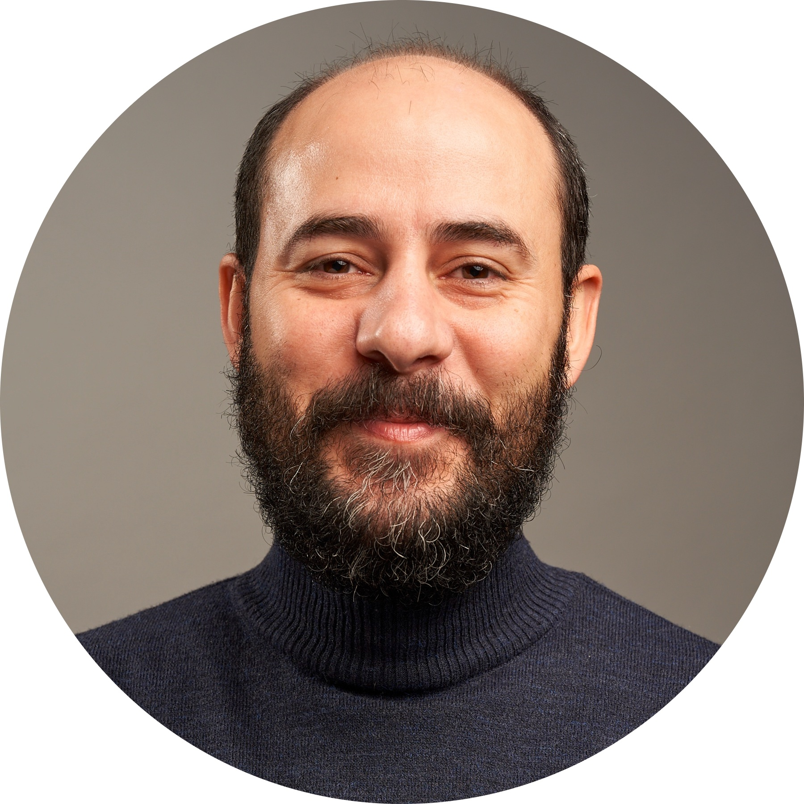

  

Hi, I'm Afon (Mohammad) Khari, a researcher with a background in **Brain and Cognitive Sciences**, **Philosophy**, and **Language**. 

My interdisciplinary academic path has taken me from humanities to the frontiers of cognitive neuroscience and data modeling.

I’m currently a student at the University of Amsterdam and have done research projects at Music Cognition Group, Institute for Logic, Language, and Computation (ILLC) and Donders Institute and Radboud University Medical Center, Developmental Neuroscience (Lifespan Cognitive Dynamics lab).  
My research bridges analytical modeling and experiential learning, touching on everything from attention and perception to AI and creativity in education.

Feel free to explore my [CV](cv.html), check out my [research](research.html), or browse recent [publications](publications.html).
